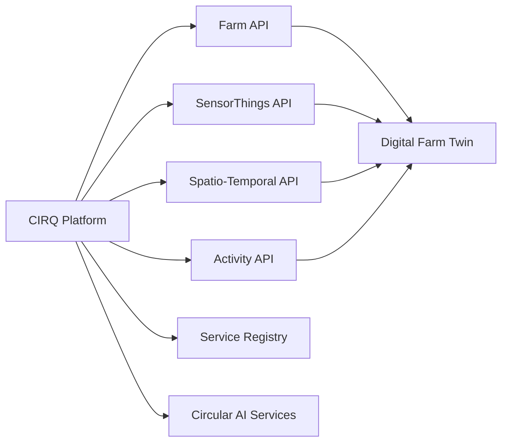
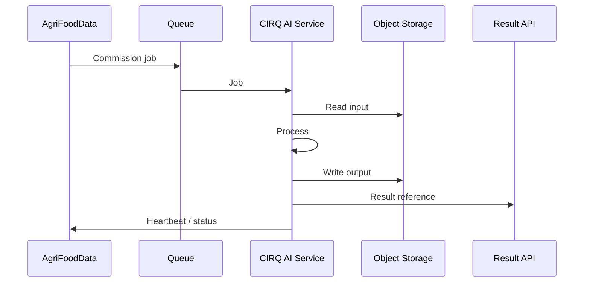
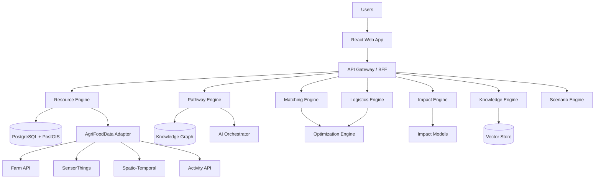
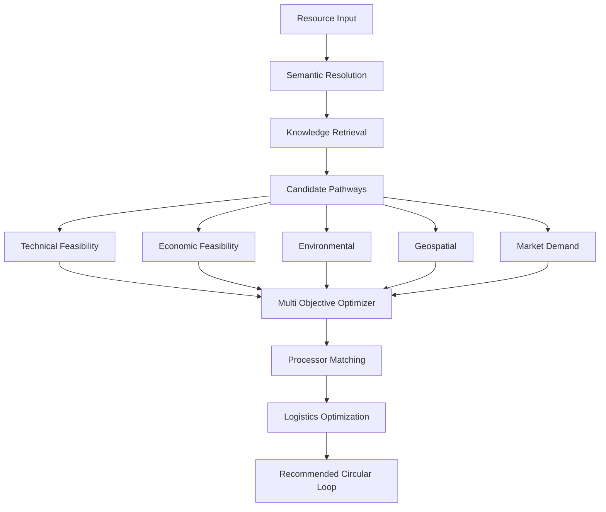
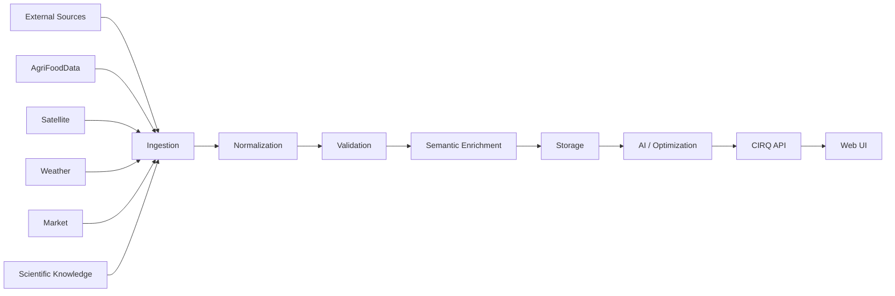
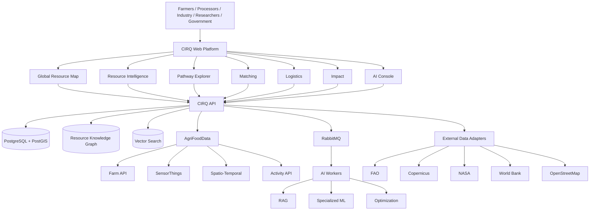

# CIRQ — Circular Agri-Food Intelligence
## Complete Technical Blueprint, Product Specification, Data Strategy, AI Architecture, API Surface and Development Reference

> Status: Development master document  
> Product: CIRQ — Circular Agri-Food Intelligence  
> Focus: AI-enabled sustainable and circular agri-food systems  
> Primary objective: Build a real, globally extensible circular-resource intelligence platform rather than a static hackathon demo.

---

## 1. Executive Summary

CIRQ is a global intelligence layer for circular agri-food systems.

The central idea is simple:

> A resource stream that is considered waste by one actor can become a feedstock, product, energy source, nutrient source or industrial input for another actor.

The platform discovers those opportunities and evaluates them against real-world constraints.

The system is therefore not simply a waste marketplace and not simply an agricultural AI assistant.

It combines:

```text
Agricultural / Food-System Data
            ↓
Resource Identification
            ↓
Semantic Resolution
            ↓
Composition & Quality
            ↓
Circular Pathway Discovery
            ↓
Technical Feasibility
            ↓
Economic Feasibility
            ↓
Supply–Demand Matching
            ↓
Logistics Optimization
            ↓
Processing
            ↓
Impact Measurement
            ↓
New Product / Resource
            ↓
Next Circular Loop
```

The project should be implemented as an actual web platform whose UI is the operational demonstration of this engine.

The supplied hackathon material explicitly frames the objective as making data, AI, knowledge and digital services work together rather than creating another isolated farmer app. It also calls for practical, demonstrable, interoperable and reusable solutions with prototype/source-code/functional demonstration deliverables. fileciteturn1file0L228-L230

---

# 1. Challenge Alignment

The selected challenge is:

## Sustainable and Circular Agri-Food Systems

The solution should address one or more of:

- circular bioeconomy
- agricultural waste-to-wealth
- renewable energy
- by-product utilization
- resource recovery
- recycling
- biodiversity
- resource efficiency
- low-waste food systems

CIRQ focuses on agricultural and food-system resource streams and connects them to viable circular pathways.

The platform should remain global rather than being designed around one country.

---

# 2. Product Vision

## 3.1 Product statement

CIRQ turns resource streams into intelligence.

Instead of asking:

> “What can we do with agricultural waste?”

the system asks:

> “Given this material, its composition, quantity, location, season, current demand, processing capabilities, transport cost, environmental constraints and available technologies, what is the best viable circular pathway?”

That distinction is the central product innovation.

---

# 3. Solution Scope and Implementation Baseline

## Problem addressed

Agricultural and food systems generate crop residues, animal waste, food-processing by-products and other underutilized resource streams. The core problem is not simply identifying possible uses; it is determining which circular pathway is feasible for a specific resource under real constraints such as composition, quality, quantity, location, seasonality, processing requirements, demand, transportation, economics and environmental conditions.

CIRQ addresses the fragmentation between agricultural data, resource information, processing knowledge, matching, logistics and environmental assessment.

## Challenge alignment

Primary challenge theme:

- Sustainable and Circular Agri-Food Systems

Relevant areas include:

- circular bioeconomy
- agricultural waste to wealth
- by-product utilization
- resource recovery and recycling
- renewable energy applications

Secondary challenge theme:

- Digital Agricultural Supply Chains

The supply-chain flow is:

```text
Resource Supply
    ↓
Processing Capacity
    ↓
Demand
    ↓
Matching
    ↓
Logistics
    ↓
Circular Outcome
```

## Primary beneficiaries

CIRQ is intended to support:

- small and marginal farmers
- farmer organizations / FPOs / cooperatives
- agri-food SMEs
- processors
- traders and other supply-chain actors
- researchers
- government and policy stakeholders

FPOs and cooperatives can perform resource aggregation and coordinate fragmented supply, while processors and agri-food SMEs can discover feedstock and processing opportunities. Supply-chain actors can coordinate movement and logistics.

## Geographic and commodity scope

India is the initial demonstration context, while the underlying architecture is global, commodity agnostic and geographically adaptable.

The same architecture should be able to support:

- rice residues
- sugarcane residues
- oilseed residues
- horticultural residues
- livestock waste
- food-processing by-products
- other biomass-intensive agricultural resources

Regional adapters may supply local crop data, resource characteristics, processing technologies, market conditions, regulations, logistics information and agricultural datasets.

## Implementation stack baseline

The application material specifies the following initial implementation stack:

```text
React
TypeScript
Vite
Python
FastAPI
IBM Db2
LangChain
Ollama
Qwen
MapLibre GL JS
D3.js
```

IBM Db2 is the intended primary structured-data and vector platform for the initial implementation. LangChain provides RAG and workflow orchestration, while Qwen runs locally through Ollama for the initial model layer.

The AI model layer remains replaceable. Larger hosted or specialized models can be introduced later without redesigning the underlying data, RAG, API or interoperability layers.

For reproducible development and testing, IBM Db2 Community Edition should be used for schema validation, vector-search testing, integration testing and end-to-end RAG testing.

The initial web application may be deployed through Vercel or Netlify, with backend, database and AI services operating as independently scalable components.

## AI and decision-support boundary

The RAG pipeline combines:

```text
Semantic Vector Retrieval
+
Structured Db2 Queries
+
Domain Knowledge
+
Verified Processing Knowledge
```

AI supports:

- semantic resource identification
- knowledge retrieval
- circular pathway discovery
- matching
- decision support
- orchestration

Dedicated deterministic services remain responsible for quantitative calculations and optimization where appropriate.

## Required data categories

CIRQ requires:

- agricultural and farm data
- resource-stream data
- processing data
- demand and market data
- geospatial data
- environmental and climate data
- logistics data
- scientific and knowledge data

Open and interoperable datasets, APIs and standards should be preferred while allowing locally relevant data to be incorporated.

## Interoperability

CIRQ is designed as an interoperable service rather than an isolated application. It should integrate with the GI AI4AFS Open Reference Architecture and use its available data and service interfaces where applicable.

The target integration areas include:

- Farm API
- SensorThings API
- Spatio-Temporal API
- Activity API
- Service Registry

The goal is for CIRQ services to become reusable building blocks within the wider GI AI4AFS ecosystem.

## Expected impact

CIRQ aims to enable:

- increased recovery and productive utilization of agricultural residues and food-processing by-products
- reduced uncontrolled disposal, burning or underutilization where applicable
- additional value and potential revenue opportunities for resource suppliers
- better utilization of existing processing and recovery infrastructure
- reduced unnecessary transportation through geographically informed matching
- improved reuse, recycling, nutrient recovery and renewable-energy pathways
- better visibility of circular resource flows
- evidence-based measurement of resource recovery, waste diversion, economic outcomes and environmental benefits

Impact should be measured using actual resource, processing and transaction data where available rather than relying only on generic estimates.

## Scaling and sustainability

CIRQ should scale through reusable core capabilities:

```text
Resource Representation
+
Circular Pathway Knowledge
+
Semantic Retrieval
+
AI Decision Support
+
Matching
+
Optimization
+
Geospatial Intelligence
+
Impact Assessment
+
Interoperability
```

Regional adapters can add local data and constraints without rebuilding the core platform.

Beyond the initial hackathon implementation, services can be adopted by FPOs, processors, agri-food SMEs, researchers, development organizations and public-sector programs. The architecture should prioritize open interfaces, reusable components, documentation and interoperability.

---

# 4. What CIRQ Is

CIRQ is:

- a resource intelligence platform
- a circular-resource knowledge graph
- a geospatial intelligence system
- a pathway discovery engine
- a supply-demand matching engine
- a logistics optimization system
- an environmental/economic impact engine
- an interoperable AI-service layer
- a visual operating interface for circular agri-food systems

CIRQ is not:

- a generic chatbot
- a normal farmer-management dashboard
- a simple waste marketplace
- a static sustainability calculator
- a collection of disconnected AI agents
- a fake 3D visualization
- an LLM trained to memorize thousands of waste types

---

# 5. Core Product Loop


---

# 6. Primary Users

## Farmers / FPOs

Need to:

- identify available residues
- understand their potential
- find nearby processors
- estimate value
- find collection options
- understand viable pathways

## Processors

Need to:

- discover feedstock
- forecast supply
- find nearby resources
- evaluate quality
- manage capacity
- receive optimized routes

## Industry

Need to:

- find secondary materials
- identify suppliers
- compare pathways
- evaluate cost
- assess environmental impact

## Researchers

Need to:

- inspect resource properties
- compare pathways
- access provenance
- inspect scientific evidence
- study spatial patterns

## Government / Policy

Need to:

- see resource availability
- identify regional bottlenecks
- compare circular opportunities
- monitor environmental impact
- plan infrastructure

---

# 7. Global Resource Network

This is the visual signature of CIRQ.

It must be a real geographic visualization.

Do not use an image.

Use:

```text
React
+
MapLibre GL JS
+
WebGL
+
Vector Tiles
+
GeoJSON where appropriate
+
AgriFoodData Spatio-Temporal layers
```

MapLibre GL JS is specifically designed to render interactive maps from vector tiles using WebGL in the browser. citeturn1search0turn1search1

---

# 8. Map Layers

Required:

- resource supply
- processor capacity
- demand density
- logistics routes
- circular loops
- agricultural activity
- satellite
- weather
- environmental constraints
- carbon intensity

Map controls:

- zoom
- pan
- search
- fullscreen
- fit selection
- layer selector
- filters
- date range
- resource category
- processor category

---

# 9. How the Global Map Should Work

Do not send every global resource record to the browser.

Use progressive spatial resolution.

```text
Global zoom
    ↓
Aggregated clusters
    ↓
Country zoom
    ↓
Regional clusters
    ↓
Regional zoom
    ↓
Individual resource streams
    ↓
Resource selected
    ↓
Related processors / demand / routes
```

At global zoom:

- country/region clusters
- density
- major processors
- major demand

At regional zoom:

- individual resources
- processors
- demand centres

At detailed zoom:

- actual resource records
- actual processor candidates
- logistics

---

# 10. Map Backend Query Model

Every spatial request should support:

```text
bbox
zoom
resourceType
country
region
dateFrom
dateTo
status
limit
```

Example:

```http
GET /api/v1/map/resources
  ?bbox=68,6,97,36
  &zoom=5
  &resourceType=crop_residue
  &limit=500
```

Never return unlimited resources.

---

# 11. Map Aggregation

At low zoom:

```text
resource cluster
count: 8,421
quantity: 2.8M tonnes
top categories:
  rice residue
  sugarcane residue
  maize residue
```

At higher zoom:

```text
Resource A
Resource B
Resource C
...
```

The cluster must be computed server-side or through vector-tile aggregation.

---

# 12. Map Entity Types

```text
ResourceNode
ProcessorNode
DemandNode
FarmNode
FieldNode
CollectionNode
LogisticsNode
CircularLoop
PotentialMatch
LogisticsRoute
```

---

# 13. Resource Intelligence

Example:

```text
Rice Straw

Agricultural Residue

Available
4.8 tonnes

Location
Uttar Pradesh, India

Moisture
12.4%

Ash
17.6%

Energy Potential
14.2 GJ/t
```

Sections:

- Identity
- Availability
- Composition
- Quality
- Geography
- Seasonality
- Pathways
- Processors
- Demand
- Logistics
- Economics
- Impact
- Research
- Provenance
- AI Analysis
- History

---

# 14. Resource Semantic Resolution

The platform should not require a fixed list of resources.

Input:

```text
paddy straw
rice straw
rice crop residue
धान का पुआल
```

may resolve to a canonical resource concept.

Semantic pipeline:

```text
Raw user term
     ↓
Normalization
     ↓
Ontology lookup
     ↓
AGROVOC matching
     ↓
Synonym resolution
     ↓
Context validation
     ↓
Canonical resource
```

AGROVOC provides browsing, downloadable data, SPARQL and REST interfaces, making it suitable as a vocabulary layer rather than as the entire resource ontology. citeturn0search8

---

# 15. Resource Data Model

```ts
interface Resource {
  id: string
  canonicalConceptId?: string
  name: string
  aliases: string[]
  category: string
  sourceType: string
  quantity: number
  unit: string
  location: GeoJSON.Point
  countryCode: string
  regionId?: string
  availabilityStart?: string
  availabilityEnd?: string
  seasonality?: string[]
  qualityScore?: number
  confidence?: number
  provenance: Provenance[]
}
```

---

# 16. Resource Composition

Possible fields:

- moisture
- ash
- cellulose
- hemicellulose
- lignin
- carbon
- nitrogen
- C/N ratio
- density
- volatile matter
- fixed carbon
- energy content
- contamination
- particle size
- pH
- protein
- fat
- fibre

Not every resource will have every property.

Represent:

```text
measured
estimated
inferred
unknown
```

---

# 17. Thousands of Resources

Do not create:

```text
waste_001
waste_002
...
waste_10000
```

Instead build a compositional model.

```text
Resource
 ├── Identity
 ├── Properties
 ├── Composition
 ├── Source
 ├── Geography
 ├── Availability
 ├── Pathways
 ├── Processors
 └── Demand
```

This allows new resources to enter without rewriting the platform.

---

# 18. Circular Resource Knowledge Graph

Core relationships:

```text
Crop
 ↓
Agricultural Activity
 ↓
Resource Stream
 ↓
Composition
 ↓
Processing Technology
 ↓
Intermediate
 ↓
Product
 ↓
Market / End Use
 ↓
Environmental Effect
 ↓
New Agricultural Cycle
```

Graph example:

```text
Rice
  ↓
Rice Straw
  ├── Biochar
  │     └── Soil application
  │
  ├── Biogas
  │     └── Energy
  │
  ├── Pellets
  │     └── Industrial heat
  │
  └── Compost
        └── Soil amendment
```

---

# 19. Pathway Explorer

Pathways:

- Biochar
- Biogas
- Pellets
- Compost
- Animal feed
- Biomaterials
- Nutrient recovery
- Renewable energy
- other verified pathways

The system should not recommend a pathway merely because it exists in a knowledge base.

It must evaluate feasibility.

---

# 20. Pathway Scoring

Candidate score should combine:

```text
technical feasibility
economic value
environmental benefit
resource recovery
local demand
processing availability
transport cost
processing cost
seasonality
regulatory constraints
uncertainty
```

Conceptual:

```text
Score =
  technical
+ economic
+ environmental
+ market
+ availability
- transport
- processing
- risk
```

Weights must be configurable.

The exact numerical model must be documented and tested.

---

# 21. Pathway Simulator

User inputs:

- resource
- quantity
- location
- composition
- processor
- technology
- transport
- energy cost
- market price
- conversion efficiency

Outputs:

- product quantity
- energy
- revenue
- processing cost
- transport cost
- net value
- carbon effect
- resource recovery
- confidence
- constraints

---

# 22. Sankey Visualization

Example:

```text
10 tonnes rice straw
        │
 ┌──────┼────────┐
 ↓      ↓        ↓
Biochar Biogas   Compost
5.2 t   2.8 t    1.5 t
 ↓       ↓        ↓
Soil    Energy   Fertility
```

The Sankey must be connected to actual API state.

Selecting a branch should update:

- map
- processors
- logistics
- impact
- economics

---

# 23. Processor Intelligence

Processor record:

```ts
interface Processor {
  id: string
  name: string
  location: GeoJSON.Point
  capabilities: string[]
  supportedResources: string[]
  capacityPerDay?: number
  availableCapacity?: number
  minimumBatch?: number
  maximumBatch?: number
  qualityRequirements?: Record<string, unknown>
  certifications?: string[]
  status: string
}
```

---

# 24. Processor Matching

Input:

```text
resource
quantity
quality
location
date
```

Output:

```text
processor
distance
capacity
match score
quality compatibility
estimated value
transport cost
CO2
```

---

# 25. Marketplace

The marketplace is a matching interface, not e-commerce.

```text
RESOURCE SUPPLY
        ↓
AI MATCHING
        ↓
PROCESSOR / DEMAND
        ↓
LOGISTICS
```

The UI should show why a match is good.

---

# 26. Logistics

For every proposed route:

- origin
- destination
- distance
- travel time
- transport mode
- capacity
- cost
- carbon
- constraints
- alternative routes

The route must be rendered on a real map.

---

# 27. Impact Observatory

Metrics:

- resource recovered
- waste diverted
- energy recovered
- nutrients recovered
- CO2e avoided
- economic value
- water impact
- circular loops
- farmer participation

Every value must contain:

```text
value
unit
methodology
source
timestamp
scope
uncertainty
```

---

# 28. Carbon / Sustainability Calculation

Use established methodologies where applicable rather than inventing carbon factors.

FAO EX-ACT covers GHG emissions and carbon stock changes across agricultural, forestry and land-use interventions and is based primarily on IPCC methodologies. citeturn0search0turn0search3

FAO EX-ACT VC extends sustainability analysis across agrifood value chains and considers emissions from processing, storage, packaging and transport alongside economic and social indicators. citeturn0search12

CIRQ should therefore use:

```text
verified emission factors
+
documented methodology
+
transport calculation
+
processing calculation
+
baseline
```

rather than simply generating an LLM estimate.

---

# 29. Food Loss / Waste Data

FAO's Food Loss and Waste Database is especially relevant for the global waste intelligence layer.

As of January 2026, FAO reported almost 40,000 data points across 167 countries and 296 commodities/commodity groups, with data drawn from scientific literature, reports and other sources. citeturn2search1

Use it for:

- food loss patterns
- food waste patterns
- commodity-level loss
- geography
- value-chain stage
- research grounding

Official:

https://www.fao.org/platform-food-loss-waste/flw-data

---

# 30. Global Agricultural Production

FAOSTAT should be a foundational source for:

- crop production
- harvested area
- livestock
- production/utilization
- agricultural commodities
- country-level statistics

FAO states that its agricultural data collection feeds FAOSTAT and Food Balance Sheets. citeturn0search16

Official:

https://www.fao.org/faostat/

Data downloads:

https://www.fao.org/faostat/en/#data

---

# 31. FAO Hand-in-Hand Geospatial Platform

The Hand-in-Hand platform is highly relevant to CIRQ because it combines agricultural statistics and geospatial datasets and supports map-based exploration, overlays and global-to-subnational analysis. citeturn2search11turn2search12

Use as a research/data-discovery layer.

Official:

https://www.fao.org/hih-geospatial-platform/

Quickstart:

https://www.fao.org/hih-geospatial-platform/get-started/quick-start-guide/

Resources:

https://www.fao.org/hih-geospatial-platform/get-started/resources/

---

# 32. FAO Bioenergy and Food Security

FAO's BEFS Rapid Appraisal includes tools for:

- biomass residues supply and mobilization
- briquettes
- pellets
- charcoal
- community biogas

This is directly relevant to pathway modelling. citeturn0search15

Official:

https://www.fao.org/energy/resources/tools/bioenergy-and-food-security/befs-rapid-appraisal/en

Use these resources to inform pathway assumptions and validate calculations.

---

# 33. AGROVOC

Use AGROVOC for:

- crop vocabulary
- soil concepts
- agricultural practices
- inputs
- outputs
- materials
- multilingual semantic matching

Official:

https://agrovoc.fao.org/

Interfaces:

- REST
- SPARQL
- downloadable data

Do not make AGROVOC the only ontology.

Use:

```text
AGROVOC
+
AgriFoodData ontology
+
CIRQ circular-resource ontology
```

---

# 34. Copernicus Sentinel-2

Use Sentinel-2 for:

- land cover
- agricultural activity
- vegetation indicators
- resource context
- crop mapping
- seasonal monitoring

The Copernicus Data Space Ecosystem provides Sentinel-2 access and describes its use for land monitoring, agriculture, forestry, climate and related applications. citeturn1search10turn1search13

Official:

https://dataspace.copernicus.eu/

Sentinel-2:

https://dataspace.copernicus.eu/data-collections/copernicus-sentinel-missions/sentinel-2

---

# 35. ESA WorldCover

Useful for:

- land cover
- agricultural area
- contextual geographic filtering
- environmental constraints

ESA WorldCover provides 10 m land-cover products and annual composites based on Sentinel-1/Sentinel-2. It also provides WMS/WMTS and Cloud Optimized GeoTIFF access. citeturn2search4

Official:

https://esa-worldcover.org/

Data:

https://esa-worldcover.org/en/data-access

---

# 36. NASA POWER

Use NASA POWER for:

- temperature
- solar radiation
- precipitation-related parameters where available
- meteorological context
- energy potential
- climate variables

NASA POWER provides REST APIs designed for application developers and analysis-ready data access. citeturn1search2turn1search5

Official:

https://power.larc.nasa.gov/

API:

https://power.larc.nasa.gov/docs/services/api/

---

# 37. ECMWF / ERA5

Use ERA5 for:

- historical weather
- climate context
- seasonal analysis
- anomaly analysis
- resource availability modelling

Official:

https://www.ecmwf.int/en/forecasts/dataset/ecmwf-reanalysis-v5

Copernicus Climate Data Store:

https://cds.climate.copernicus.eu/

Do not use historical weather data as if it were real-time weather.

---

# 38. World Bank Commodity Data

Use World Bank commodity data for:

- commodity price context
- energy price context
- global market trends
- pathway economic modelling

World Bank publishes Commodity Markets / Pink Sheet datasets and updated monthly/annual price files. citeturn2search6turn2search15

Official:

https://www.worldbank.org/en/research/commodity-markets

Pink Sheet:

https://thedocs.worldbank.org/en/doc/74e8be41ceb20fa0da750cda2f6b9e4e-0050012026/world-bank-commodities-price-data-the-pink-sheet

---

# 39. FAO Food Price Index

Use for food commodity market context.

Official:

https://www.fao.org/worldfoodsituation/foodpricesindex/en/

The index tracks international food commodity price movements and provides downloadable historical datasets. citeturn0search4

---

# 40. IPCC Emission Factors

Use IPCC methodologies and official emission-factor resources where applicable.

Official:

https://www.ipcc-nggip.iges.or.jp/EFDB/

Do not hardcode emission factors without storing:

- source
- factor
- unit
- geography
- year
- methodology
- uncertainty

---

# 41. OpenAQ

Potentially useful for:

- ambient air quality
- environmental monitoring
- combustion/processing context
- pollution indicators

OpenAQ provides global public air-quality data through REST APIs and currently documents API v3. citeturn2search0turn2search9

Official:

https://openaq.org/

API docs:

https://docs.openaq.org/

Use only where air quality is relevant to a decision.

---

# 42. OpenStreetMap

Use for:

- roads
- facilities
- transport network context
- geographic features
- local infrastructure

Official:

https://www.openstreetmap.org/

Documentation:

https://wiki.openstreetmap.org/wiki/API

Overpass:

https://wiki.openstreetmap.org/wiki/Overpass_API

Follow OSM attribution and usage policies.

Do not overload public Overpass servers with large production queries.

---

# 43. MapLibre

Map rendering:

https://maplibre.org/maplibre-gl-js/docs/

Use MapLibre because it renders vector-tile maps in WebGL and provides map interaction and source/layer APIs. citeturn1search0

Examples:

https://maplibre.org/maplibre-gl-js/docs/examples/

Performance:

https://maplibre.org/maplibre-gl-js/docs/guides/

---

# 44. OGC Standards

Use open standards wherever possible.

OGC API:

https://ogcapi.ogc.org/

OGC API Features:

https://ogcapi.ogc.org/features/

OGC SensorThings:

https://ogcapi.ogc.org/sensorthings/

GeoJSON:

https://geojson.org/

STAC:

https://stacspec.org/

Cloud Optimized GeoTIFF:

https://www.cogeo.org/

These should be preferred over proprietary geographic formats.

---

# 45. Zarr

Zarr is useful for large multidimensional scientific datasets and is already relevant to the AgriFoodData spatial output architecture.

Official:

https://zarr.dev/

Documentation:

https://zarr.readthedocs.io/

---

# 46. AgriFoodData / NaLamKI

Primary architecture reference:

https://nalamki.github.io/

GitHub:

https://github.com/NaLamKI

GitMCP:

https://gitmcp.io/NaLamKI

Use the ecosystem as an interoperability foundation.

Do not clone the entire platform into CIRQ.

---

# 47. AgriFoodData APIs

Core:

- Farm API
- SensorThings API
- Spatio-Temporal API
- Activity API
- Service Registry

The Digital Farm Twin is the central domain concept.

CIRQ should consume and contribute data through these interfaces where the target deployment supports them.

---

# 48. NaLamKI Repositories

Relevant repositories:

StarterKit:
https://github.com/NaLamKI/StarterKit

SDK:
https://github.com/NaLamKI/SDK

Application SDK:
https://github.com/NaLamKI/Application-SDK

Data Model:
https://github.com/NaLamKI/datamodel

Ontology:
https://github.com/NaLamKI/ontology

Geo-AI:
https://github.com/NaLamKI/geo-ai

Use:

```text
StarterKit
→ pattern/reference

SDK
→ dependency/integration

datamodel
→ domain contract

ontology
→ vocabulary/semantic alignment

geo-ai
→ deployment/reference

Application-SDK
→ optional application integration
```

---

# 49. AgriFoodData Architecture



---

# 50. AgriFoodData AI Service Pattern



For large outputs, use object references rather than embedding large files in JSON.

---

# 51. AgriFoodData Service Registry Caveat

Do not assume self-service registration exists in the target deployment.

Current public documentation describes service onboarding as an out-of-band process and documents service lifecycle concepts.

Therefore:

```text
if official deployment exposes registry:
    integrate directly

else:
    use documented registration workflow
    keep adapter isolated
    use local development registry
```

Never invent a production endpoint.

---

# 52. CIRQ Backend Architecture



---

# 53. Backend Technology

The initial hackathon implementation baseline is:

```text
Python
FastAPI
IBM Db2
LangChain
Ollama
Qwen
Redis
RabbitMQ
S3-compatible storage
```

IBM Db2 is the primary structured-data and vector platform for the application baseline. LangChain connects the AI workflow to Db2 Vector Store for retrieval-augmented generation.

The broader architecture may support PostgreSQL/PostGIS as an alternative deployment where required:

```text
PostgreSQL
PostGIS
Pydantic
SQLAlchemy
GeoAlchemy
```

The choice of database implementation must not change the resource model, API contracts, interoperability interfaces or circular-resource reasoning layer.

Alternative backend services can use Node.js/TypeScript if the team prefers, but the AI/scientific layer is naturally suited to Python.

---

# 54. Client Application Technology

The implementation baseline stated in the application material is:

```text
React
TypeScript
Vite
MapLibre GL JS
D3.js
```

Use React and TypeScript for the client application, MapLibre GL JS for the operational geospatial layer, and D3.js for data-driven resource-flow and pathway visualizations.

The client must consume the modular FastAPI services through documented APIs. No particular visual design system, color palette, animation framework or UI component library is part of the product specification.

---

# 55. AI Architecture



---

# 56. LLM Responsibilities

Use LLMs for:

- natural language understanding
- resource-name normalization
- semantic interpretation
- retrieval
- explanation
- assistant queries
- query-to-filter conversion
- summarization

Do not use an LLM as the authority for:

- scientific constants
- numerical calculations
- routing
- emissions factors
- market prices
- capacity
- regulatory requirements

---

# 57. RAG

RAG should combine:

```text
Scientific Knowledge
+
AgriFoodData
+
Operational Data
+
Resource Knowledge
+
Verified Processing Data
```

Retrieval metadata:

```text
source
title
url
publication date
resource
pathway
geography
evidence type
confidence
```

---

# 58. Specialized ML

Possible models:

Resource classification
Composition estimation
Biomass availability
Yield prediction
Biogas potential
Biochar yield
Compost maturity
Demand forecasting
Price forecasting
Processing feasibility

Only train a specialized model when enough verified training data exists.

---

# 59. Fine-Tuning Strategy

Do not fine-tune a general LLM simply to memorize thousands of resources.

Instead:

```text
Ontology
+
Knowledge Graph
+
RAG
+
Specialized ML
+
Optimization
```

Fine-tuning becomes useful later for:

- resource classification
- domain terminology
- multilingual normalization
- extraction from agricultural documents
- pathway classification

---

# 60. Agentic Architecture

Potential agents:

```text
Resource Resolver
Resource Profiler
Pathway Discovery
Pathway Ranking
Processor Matcher
Logistics Optimizer
Economic Optimizer
Environmental Analyst
Regulatory Analyst
Circularity Verifier
```

Agents should orchestrate tools.

They should not replace deterministic domain engines.

---

# 61. Agent Execution

```text
Agent
 ↓
Tool
 ↓
Structured result
 ↓
Validation
 ↓
Next tool
 ↓
Decision
```

Do not allow arbitrary agents to execute unrestricted database queries.

Use typed tools.

---

# 62. AI Execution Trace

The UI should show:

```text
Resource detected                  ✓
Semantic resolution                ✓
Composition retrieved              ✓
Pathways generated                 ✓
Feasibility evaluated              ✓
Processor matching                 ✓
Logistics optimized                ✓
Impact calculated                  ✓
```

This is an operational trace.

Do not expose private model chain-of-thought.

Expose:

- service
- input reference
- output reference
- duration
- confidence
- data sources
- status
- errors

---

# 63. Public API

Base:

```text
/api/v1
```

---

# 64. System Endpoints

```http
GET /api/v1/health
GET /api/v1/health/live
GET /api/v1/health/ready
GET /api/v1/system/status
GET /api/v1/system/metrics
GET /api/v1/system/events
GET /api/v1/system/events/stream
```

---

# 65. Resource Endpoints

```http
GET    /api/v1/resources
POST   /api/v1/resources
GET    /api/v1/resources/{resourceId}
PATCH  /api/v1/resources/{resourceId}
DELETE /api/v1/resources/{resourceId}

GET /api/v1/resources/{resourceId}/availability
GET /api/v1/resources/{resourceId}/composition
GET /api/v1/resources/{resourceId}/quality
GET /api/v1/resources/{resourceId}/pathways
GET /api/v1/resources/{resourceId}/processors
GET /api/v1/resources/{resourceId}/demand
GET /api/v1/resources/{resourceId}/logistics
GET /api/v1/resources/{resourceId}/impact
GET /api/v1/resources/{resourceId}/provenance
GET /api/v1/resources/{resourceId}/history

POST /api/v1/resources/resolve
POST /api/v1/resources/profile
POST /api/v1/resources/import
POST /api/v1/resources/{resourceId}/analyze
```

---

# 66. Search Endpoints

```http
GET  /api/v1/search/resources
GET  /api/v1/search/processors
GET  /api/v1/search/demand
GET  /api/v1/search/regions
GET  /api/v1/search/pathways
POST /api/v1/search/natural-language
```

Natural language should produce structured intent.

---

# 67. Map Endpoints

```http
GET /api/v1/map/overview
GET /api/v1/map/resources
GET /api/v1/map/processors
GET /api/v1/map/demand
GET /api/v1/map/routes
GET /api/v1/map/loops
GET /api/v1/map/clusters
```

---

# 68. Network Endpoints

```http
GET  /api/v1/network
GET  /api/v1/network/nodes
GET  /api/v1/network/edges
GET  /api/v1/network/clusters
GET  /api/v1/network/{resourceId}
POST /api/v1/network/query
```

---

# 69. Pathway Endpoints

```http
GET  /api/v1/pathways
POST /api/v1/pathways
GET  /api/v1/pathways/{pathwayId}
PATCH /api/v1/pathways/{pathwayId}

POST /api/v1/pathways/discover
POST /api/v1/pathways/rank
POST /api/v1/pathways/compare
```

---

# 70. Simulation Endpoints

```http
POST /api/v1/simulations
GET  /api/v1/simulations/{simulationId}
GET  /api/v1/simulations/{simulationId}/status
GET  /api/v1/simulations/{simulationId}/result
POST /api/v1/simulations/{simulationId}/cancel
```

---

# 71. Processor Endpoints

```http
GET    /api/v1/processors
POST   /api/v1/processors
GET    /api/v1/processors/{processorId}
PATCH  /api/v1/processors/{processorId}
DELETE /api/v1/processors/{processorId}

GET /api/v1/processors/{processorId}/capacity
GET /api/v1/processors/{processorId}/capabilities
GET /api/v1/processors/{processorId}/demand
GET /api/v1/processors/{processorId}/queue
GET /api/v1/processors/{processorId}/impact

POST /api/v1/processors/match
```

---

# 72. Matching Endpoints

```http
POST /api/v1/matching/resources
POST /api/v1/matching/processors
POST /api/v1/matching/demand

GET /api/v1/matching/{matchId}
GET /api/v1/matching/{matchId}/explanation
```

---

# 73. Logistics Endpoints

```http
POST /api/v1/logistics/route
POST /api/v1/logistics/optimize
GET  /api/v1/logistics/routes
GET  /api/v1/logistics/routes/{routeId}
POST /api/v1/logistics/compare
```

---

# 74. Impact Endpoints

```http
GET  /api/v1/impact/overview
GET  /api/v1/impact/resources/{resourceId}
GET  /api/v1/impact/pathways/{pathwayId}
GET  /api/v1/impact/processors/{processorId}
POST /api/v1/impact/calculate
GET  /api/v1/impact/provenance/{impactId}
```

---

# 75. AI Endpoints

```http
GET  /api/v1/ai/services
GET  /api/v1/ai/services/{serviceId}
GET  /api/v1/ai/services/{serviceId}/health
GET  /api/v1/ai/services/{serviceId}/schema
GET  /api/v1/ai/services/{serviceId}/executions

POST /api/v1/ai/services/{serviceId}/execute

GET  /api/v1/ai/executions
GET  /api/v1/ai/executions/{executionId}
GET  /api/v1/ai/executions/{executionId}/status
GET  /api/v1/ai/executions/{executionId}/trace
GET  /api/v1/ai/executions/{executionId}/result
POST /api/v1/ai/executions/{executionId}/cancel
```

---

# 76. Provenance Endpoints

```http
GET /api/v1/provenance/resources/{resourceId}
GET /api/v1/provenance/pathways/{pathwayId}
GET /api/v1/provenance/impacts/{impactId}
GET /api/v1/provenance/executions/{executionId}
```

---

# 77. Data Source Endpoints

```http
GET /api/v1/data/sources
GET /api/v1/data/sources/{sourceId}
GET /api/v1/data/sources/{sourceId}/health
GET /api/v1/data/sources/{sourceId}/schema
GET /api/v1/data/sources/{sourceId}/freshness
GET /api/v1/data/sources/{sourceId}/coverage
```

---

# 78. Integration Endpoints

```http
GET    /api/v1/integrations
GET    /api/v1/integrations/{integrationId}
POST   /api/v1/integrations
PATCH  /api/v1/integrations/{integrationId}
DELETE /api/v1/integrations/{integrationId}

POST /api/v1/integrations/{integrationId}/test
POST /api/v1/integrations/{integrationId}/sync
GET  /api/v1/integrations/{integrationId}/logs
```

---

# 79. Scenario Endpoints

```http
GET    /api/v1/scenarios
POST   /api/v1/scenarios
GET    /api/v1/scenarios/{scenarioId}
PATCH  /api/v1/scenarios/{scenarioId}
DELETE /api/v1/scenarios/{scenarioId}

POST /api/v1/scenarios/{scenarioId}/run
GET  /api/v1/scenarios/{scenarioId}/status
GET  /api/v1/scenarios/{scenarioId}/result
POST /api/v1/scenarios/compare
```

---

# 80. Circular Loop Endpoints

```http
GET    /api/v1/loops
POST   /api/v1/loops
GET    /api/v1/loops/{loopId}
PATCH  /api/v1/loops/{loopId}
DELETE /api/v1/loops/{loopId}

POST /api/v1/loops/validate
POST /api/v1/loops/simulate
GET  /api/v1/loops/{loopId}/impact
```

---

# 81. Research Endpoints

```http
GET /api/v1/knowledge/search
GET /api/v1/knowledge/resources/{resourceId}
GET /api/v1/knowledge/pathways/{pathwayId}
GET /api/v1/knowledge/sources/{sourceId}
```

---

# 82. AgriFoodData Adapter

The backend should isolate all external AgriFoodData calls.

```text
src/integrations/agrifooddata/

farm.ts
sensorthings.ts
spatiotemporal.ts
activity.ts
serviceRegistry.ts
auth.ts
types.ts
client.ts
```

Never scatter AgriFoodData URLs across application code.

---

# 83. Environment Variables

```env
APP_ENV=development

DATABASE_URL=
REDIS_URL=
RABBITMQ_URL=
OBJECT_STORAGE_ENDPOINT=
OBJECT_STORAGE_BUCKET=
OBJECT_STORAGE_ACCESS_KEY=
OBJECT_STORAGE_SECRET_KEY=

AGRIFOODDATA_API_BASE_URL=
AGRIFOODDATA_STA_BASE_URL=
AGRIFOODDATA_SPATIOTEMPORAL_BASE_URL=
AGRIFOODDATA_KEYCLOAK_URL=
AGRIFOODDATA_CLIENT_ID=
AGRIFOODDATA_CLIENT_SECRET=

LLM_PROVIDER=
LLM_BASE_URL=
LLM_MODEL=
LLM_API_KEY=

EMBEDDING_PROVIDER=
EMBEDDING_MODEL=
EMBEDDING_API_KEY=

MAP_STYLE_URL=
```

Never commit secrets.

---

# 84. Database

For the initial application implementation:

```text
IBM Db2
```

Db2 is the primary structured-data and vector platform specified in the application baseline. Structured agricultural, resource, geospatial and processing data should coexist with vector representations used for semantic retrieval.

PostgreSQL + PostGIS remains a supported alternative architecture where a deployment requires it.

Core tables:

```text
resources
resource_aliases
resource_properties
resource_compositions
resource_availability
resource_locations
resource_pathways
pathways
processing_facilities
processing_capabilities
processor_capacity
demand_centres
market_signals
logistics_routes
matches
circular_loops
impact_metrics
ai_services
ai_executions
ai_execution_steps
data_sources
data_lineage
scenarios
events
```

---

# 85. Spatial Database

Use PostGIS.

Indexes:

```sql
CREATE INDEX idx_resources_location
ON resources
USING GIST(location);
```

Use spatial queries for:

- nearest processors
- resource clusters
- regional density
- route candidates
- geographic constraints

---

# 86. Vector Store

For the initial application implementation, use IBM Db2 Vector Store through the LangChain Db2 integration.

The vector layer should support semantic retrieval for:

- resource descriptions
- scientific documents
- pathway descriptions
- processing technologies
- research papers

Alternative vector stores may be used in deployments where required, but the retrieval contract should remain implementation independent.

Embeddings should represent:

- resource descriptions
- scientific documents
- pathway descriptions
- processing technologies
- research papers

---

# 87. Knowledge Graph

Potential implementations:

- PostgreSQL relationship tables
- Neo4j
- RDF triple store
- property graph

For the first implementation, PostgreSQL can represent the graph through typed relationships.

A separate graph database should be introduced only when graph traversal becomes a real bottleneck.

---

# 88. Event Architecture

Use RabbitMQ for asynchronous work where appropriate.

Events:

```text
resource.created
resource.updated
resource.profile.completed

pathway.analysis.started
pathway.analysis.completed

match.created
route.optimized

processing.started
processing.completed

impact.calculated
loop.created
```

---

# 89. Long-Running AI

Never block HTTP requests for long jobs.

Use:

```text
POST job
 ↓
job_id
 ↓
queue
 ↓
worker
 ↓
status
 ↓
result
```

Frontend can use:

```text
GET /status
```

or SSE:

```text
GET /system/events/stream
```

---

# 90. Data Pipeline



---

# 91. Data Quality

Every dataset should contain:

```text
source
owner
license
retrievedAt
publishedAt
geographicCoverage
temporalCoverage
resolution
unit
methodology
qualityScore
```

Quality states:

```text
verified
validated
estimated
inferred
stale
unknown
```

---

# 92. Data Provenance

A recommendation should be traceable:

```text
Recommendation
    ↓
Pathway score
    ↓
Composition
    ↓
Resource
    ↓
Farm / source
    ↓
Dataset
    ↓
Original provider
```

The UI must expose this lineage.

---

# 93. Data Freshness

Every dynamic value should show:

```text
Updated 12 min ago
```

or:

```text
Historical — 2024
```

Never show historical data as real-time.

---

# 94. Globalization

The core model must not contain:

```text
INR
India
rice
hectare
```

as hard-coded assumptions.

Instead:

```text
country
currency
unit system
language
regulation
resource taxonomy
agricultural context
processing technology
```

become configuration.

---

# 95. Country Adapters

Example:

```text
India Adapter
Brazil Adapter
Kenya Adapter
EU Adapter
Southeast Asia Adapter
```

Adapters can define:

- local datasets
- currency
- units
- regulations
- processors
- local vocabulary
- logistics assumptions

---

# 96. Units

Use a canonical unit system internally.

Recommended:

```text
mass: kg / tonne
distance: km
energy: MJ / GJ / kWh
volume: m3
currency: normalized + local
emissions: kgCO2e / tCO2e
```

Convert at the API/UI boundary.

---

# 97. Currency

Store:

```text
amount
currency
timestamp
exchangeRateSource
```

Do not silently convert old prices using current exchange rates.

---

# 98. Multilingual

Resource semantic resolution should eventually support:

- English
- Hindi
- Spanish
- Portuguese
- French
- Swahili
- Arabic
- other target languages

AGROVOC can provide multilingual terminology.

---

# 99. Offline / Low Connectivity

The system should eventually support:

- cached resource profiles
- cached pathway results
- compressed map data
- lightweight mobile interface
- queued actions

The primary hackathon demo can remain online-first.

---

# 100. Example Resource Scenarios

## Rice straw

Potential:

- biochar
- biogas
- pellets
- compost
- biomaterials

## Sugarcane bagasse

Potential:

- process heat
- pellets
- cogeneration
- biomaterials
- pulp/fibre products

## Cocoa pod husk

Potential:

- compost
- biochar
- biogas
- soil amendment
- selected biomaterials

## Coffee pulp

Potential:

- compost
- biogas
- biochar
- feed where scientifically/regulatorily appropriate

## Maize residue

Potential:

- biochar
- pellets
- animal feed where safe
- compost
- biogas

The platform must evaluate each pathway rather than claiming all are universally feasible.

---

# 101. Example End-to-End Scenario

```text
Farmer reports:
4.8 tonnes rice straw

        ↓

Semantic resolver:
Rice crop residue

        ↓

Composition:
12.4% moisture
17.6% ash

        ↓

Pathway engine:

Biochar       91
Biogas        83
Pellets       77
Compost       69

        ↓

Processor search

Biochar Facility
12 km
capacity available

        ↓

Logistics

28 km optimized route

        ↓

Impact

estimated recovery
estimated value
estimated CO2 effect

        ↓

Circular loop

Biochar
→ soil
→ crop
→ next resource
```

---

# 102. Scenario Lab

Users should be able to ask:

```text
What if biomass availability increases 30%?

What if transport costs increase 20%?

What if a new processor opens?

What if demand for biochar doubles?

What if moisture is higher than expected?
```

The system should create scenario objects and compare:

```text
baseline
vs
scenario
```

---

# 103. Research Layer

Research search should connect:

```text
resource
+
process
+
technology
+
output
+
scientific evidence
```

Each result:

```text
title
source
publication
date
resource
process
conditions
output
geography
citation
```

---

# 104. AI Assistant

The assistant should be a secondary interface.

Example:

> Why is biochar preferred for this rice straw?

Response should be grounded in:

- resource data
- pathway model
- processor data
- demand
- logistics
- scientific evidence

The assistant should cite the relevant evidence in the UI.

---

# 105. Responsible AI

Every recommendation should expose:

- confidence
- uncertainty
- evidence
- freshness
- assumptions
- limitations

Example:

```text
Biochar
91/100

High confidence

Based on:
7 verified sources
2 local processor matches
1 composition measurement
3 market signals

Constraint:
moisture estimate is partially inferred
```

---

# 106. Human Oversight

The platform is decision support.

Important operations should allow:

```text
Accept
Reject
Modify
Request more evidence
```

Do not automatically execute physical operations from an AI recommendation without authorization.

---

# 107. Performance

The system should prioritize efficient data delivery and analysis rather than loading complete global datasets at once.

Required principles:

- progressive spatial resolution
- server-side aggregation
- vector tiles where appropriate
- spatial indexes
- Redis caching where useful
- asynchronous long-running jobs
- pagination and bounded result sets
- debounced high-frequency queries
- lazy loading of heavy analytical datasets
- separation of interactive queries from heavy analysis

The operational map must never request unlimited global resource records.

---

# 108. Demo Mode

Route:

```text
/demo
```

Button:

```text
RUN GLOBAL CIRCULARITY DEMO
```

Sequence:

```text
Resource detected
        ↓
Semantic resolution
        ↓
Composition
        ↓
Pathways
        ↓
Ranking
        ↓
Processor
        ↓
Logistics
        ↓
Impact
        ↓
Circular loop
```

The demo must execute real local backend endpoints against seeded data.

---

# 109. Demo Dataset

Create deterministic records for:

India:
- rice straw
- sugarcane bagasse
- cotton residue

Brazil:
- sugarcane bagasse
- coffee residue

Kenya:
- maize residue
- coffee pulp

Southeast Asia:
- rice husk
- cassava residue

Europe:
- food-processing residues
- manure
- crop residues

Do not label synthetic demo values as real-world measurements.

---

# 110. API Documentation

Use OpenAPI.

Generate:

```text
/openapi.json
/docs
/redoc
```

Every endpoint:

- schema
- example
- authentication
- error response
- rate limit
- source

---

# 111. Error Model

Standard:

```json
{
  "error": {
    "code": "RESOURCE_NOT_FOUND",
    "message": "Resource was not found.",
    "requestId": "..."
  }
}
```

Do not expose stack traces.

---

# 112. Authentication

Use:

- OpenID Connect
- Keycloak where compatible with AgriFoodData
- PKCE for browser authentication

Roles:

```text
farmer
processor
enterprise
researcher
government
admin
```

Authorization is enforced server-side.

---

# 113. Security

Implement:

- HTTPS
- secure cookies
- token validation
- RBAC
- rate limiting
- input validation
- SQL injection protection
- CORS
- CSP
- secret management
- audit logging
- signed object URLs
- least privilege

Never expose API keys in frontend code.

---

# 114. Observability

Backend:

```text
structured logs
request ID
trace ID
latency
errors
metrics
queue depth
AI execution duration
```

Frontend:

```text
map errors
API errors
tile errors
AI failures
```

---

# 115. Testing

Frontend:

- unit tests
- component tests
- accessibility tests
- map interaction tests
- responsive tests

Backend:

- unit
- integration
- spatial
- API contract
- optimization
- AI adapter

End-to-end:

```text
Search resource
→ open resource
→ analyze
→ compare pathways
→ match processor
→ optimize route
→ inspect impact
→ inspect provenance
```

---

# 116. Repository Structure

```text
cirq/
├── apps/
│   ├── web/
│   └── api/
│
├── services/
│   ├── resource-engine/
│   ├── pathway-engine/
│   ├── matching-engine/
│   ├── logistics-engine/
│   ├── impact-engine/
│   ├── knowledge-engine/
│   └── ai-orchestrator/
│
├── packages/
│   ├── ui/
│   ├── types/
│   ├── api-client/
│   ├── map/
│   ├── charts/
│   └── config/
│
├── data/
│   ├── demo/
│   ├── seed/
│   └── schemas/
│
├── docs/
│   ├── architecture/
│   ├── api/
│   ├── ai/
│   ├── data/
│   ├── map/
│   ├── deployment/
│   ├── security/
│   └── decisions/
│
├── infra/
│   ├── docker/
│   ├── postgres/
│   ├── rabbitmq/
│   └── storage/
│
└── README.md
```

---

# 117. Documentation Requirements

The repository must contain:

```text
README.md

docs/architecture/system.md
docs/architecture/frontend.md
docs/architecture/backend.md
docs/architecture/map.md
docs/architecture/ai.md
docs/architecture/agrifooddata.md

docs/api/overview.md
docs/api/resources.md
docs/api/pathways.md
docs/api/processors.md
docs/api/matching.md
docs/api/logistics.md
docs/api/impact.md
docs/api/ai.md
docs/api/integrations.md

docs/data/resource-model.md
docs/data/ontology.md
docs/data/provenance.md
docs/data/data-sources.md

docs/ai/resource-resolution.md
docs/ai/pathway-ranking.md
docs/ai/matching.md
docs/ai/logistics.md
docs/ai/impact.md
docs/ai/explainability.md

docs/map/rendering.md
docs/map/performance.md
docs/map/data-sources.md

docs/security/authentication.md
docs/security/authorization.md
docs/security/privacy.md

docs/deployment/local.md
docs/deployment/docker.md
docs/deployment/production.md

docs/decisions/
```

---

# 118. README Requirements

README must include:

1. What CIRQ is
2. Problem
3. Solution
4. Product screenshots
5. Architecture
6. UI architecture
7. Backend architecture
8. AI architecture
9. Map architecture
10. AgriFoodData integration
11. Data sources
12. API
13. Local setup
14. Environment variables
15. Docker
16. Seed data
17. Demo
18. Testing
19. Deployment
20. Security
21. Responsible AI
22. Known limitations
23. Research references
24. License
25. Contribution guide

The README must be written as if another engineering team will inherit the project.

---

# 119. AI-Generated-Code Hygiene

Do not leave:

```text
// TODO: implement
// AI generated
// Generated by Claude
// Generated by ChatGPT
// FIXME: later
```

Do not leave placeholder implementations.

Do not leave:

```ts
throw new Error("Not implemented")
```

behind a visible feature.

Do not create buttons that do nothing.

Do not fake live data.

Do not fabricate scientific evidence.

---

# 120. Resource Confidence Evidence

Confidence must always be traceable to evidence.

Store or derive:

```text
confidence score
evidence sources
local processor evidence
measured properties
market signals
freshness
methodology
```

A confidence value without supporting evidence must not be treated as authoritative.

---

# 121. Sustainability Evidence Model

For every environmental metric, store:

```text
metric
value
method
factor source
boundary
baseline
uncertainty
```

Example:

```text
CO2e avoided
12.4 tCO2e
Boundary: collection → processing → end use
Method: documented lifecycle calculation
Source: IPCC / FAO methodology
Confidence: Medium
```

---

# 122. Data Licensing

Every source adapter must document:

```text
source
license
attribution
commercial-use restrictions
API terms
rate limits
redistribution restrictions
```

Never copy a dataset into the repository if its license does not permit it.

Prefer:

- open data
- public APIs
- downloadable open datasets
- cached derived data where legally allowed

---

# 123. Resource Source Matrix

| Domain | Primary sources |
|---|---|
| Agriculture | FAOSTAT |
| Food loss/waste | FAO FLW |
| Vocabulary | AGROVOC |
| Geospatial | FAO HiH |
| Satellite | Copernicus Sentinel |
| Land cover | ESA WorldCover |
| Weather | NASA POWER |
| Climate | ERA5 |
| Markets | World Bank |
| Food prices | FAO |
| Carbon | IPCC / FAO EX-ACT |
| Sensors | OGC SensorThings |
| Spatial API | AgriFoodData |
| Roads | OpenStreetMap |
| Air quality | OpenAQ |
| Scientific evidence | peer-reviewed literature |
| Biomass pathways | FAO BEFS / validated literature |

---

# 124. Additional Useful Resources

## FAO

https://www.fao.org/

https://www.fao.org/faostat/

https://www.fao.org/platform-food-loss-waste/

https://www.fao.org/hih-geospatial-platform/

https://www.fao.org/energy/

https://www.fao.org/agrovoc/

## Copernicus

https://dataspace.copernicus.eu/

https://dataspace.copernicus.eu/data-collections/copernicus-sentinel-missions/sentinel-2

## ESA WorldCover

https://esa-worldcover.org/

## NASA

https://earthdata.nasa.gov/

https://power.larc.nasa.gov/

## ECMWF

https://www.ecmwf.int/

https://cds.climate.copernicus.eu/

## World Bank

https://www.worldbank.org/en/research/commodity-markets

## IPCC

https://www.ipcc-nggip.iges.or.jp/

## OGC

https://www.ogc.org/

https://ogcapi.ogc.org/

https://ogcapi.ogc.org/features/

https://ogcapi.ogc.org/sensorthings/

## STAC

https://stacspec.org/

## GeoJSON

https://geojson.org/

## MapLibre

https://maplibre.org/

## OpenStreetMap

https://www.openstreetmap.org/

https://wiki.openstreetmap.org/wiki/Overpass_API

## OpenAQ

https://openaq.org/

https://docs.openaq.org/

## Zarr

https://zarr.dev/

## PostgreSQL

https://www.postgresql.org/

## PostGIS

https://postgis.net/

## Redis

https://redis.io/

## RabbitMQ

https://www.rabbitmq.com/

## OpenAPI

https://www.openapis.org/

---

# 125. Architecture Decision Records

Create ADRs for:

```text
ADR-001 MapLibre over full Three.js map
ADR-002 PostgreSQL + PostGIS
ADR-003 pgvector first
ADR-004 AgriFoodData adapter
ADR-005 RAG instead of LLM memorization
ADR-006 Deterministic optimization
ADR-007 Event-driven AI
ADR-008 Demo data strategy
ADR-009 Provenance architecture
```

---

# 126. Complete Demo Story

The pitch should follow:

```text
1. Start globally
2. Show resource network
3. Search rice straw
4. Focus on region
5. Open resource
6. Show composition
7. Generate pathways
8. Explain recommendation
9. Find processor
10. Optimize logistics
11. Calculate impact
12. Show provenance
13. Show AI execution
14. Create scenario
15. Close circular loop
```

---

# 127. What Judges Should Understand

After interacting with the system, they should understand:

```text
This is global.
This is data-driven.
This is not just a marketplace.
This is not just an LLM.
The map is real.
The resource graph is real.
The recommendations use constraints.
The logistics matter.
The economics matter.
The environmental impact matters.
The AI is modular.
The architecture is interoperable.
The system can support new resources.
```

---

# 128. What Makes CIRQ Different

Weak approach:

```text
farmer enters waste
↓
AI says "make compost"
```

CIRQ:

```text
resource
↓
canonical identity
↓
composition
↓
local availability
↓
processing technologies
↓
processor capacity
↓
market demand
↓
transport
↓
economics
↓
environmental impact
↓
constraints
↓
multi-objective optimization
↓
recommended circular pathway
```

This is the core differentiation.

---

# 129. What Not To Build

Do not build:

- generic farmer dashboard
- generic chatbot
- simple waste marketplace
- fake globe
- decorative 3D
- fake real-time metrics
- hardcoded India-only logic
- hardcoded 20-resource taxonomy
- LLM-only pathway engine
- unexplained AI scores
- fake scientific numbers
- dead UI controls

---

# 130. Final System Diagram



---

# 131. Final Technical Principle

CIRQ should be built around one invariant:

> Every important visualization must correspond to a real system concept.

Therefore:

```text
Map node
→ real resource / processor / demand entity

Map edge
→ real route / relationship / circular flow

Pathway score
→ real optimization output

Impact metric
→ documented calculation

AI trace
→ actual service execution

Data lineage
→ actual source relationship

Processor
→ actual capability/capacity record

Resource
→ canonical semantic object
```

This is what prevents the project from becoming a beautiful fake prototype.

---

# 132. Final Product Definition

CIRQ is:

```text
A global circular-resource intelligence layer
for agricultural and food systems.
```

Its core engine is:

```text
DATA
 ↓
RESOURCE
 ↓
INTELLIGENCE
 ↓
PATHWAY
 ↓
MATCH
 ↓
LOGISTICS
 ↓
PROCESS
 ↓
IMPACT
 ↓
CIRCULAR LOOP
```

The website visualizes that entire loop.

The backend makes it executable.

AgriFoodData makes it interoperable.

The knowledge graph makes it extensible.

RAG makes it evidence-aware.

Specialized ML makes it predictive.

Optimization makes it actionable.

The map makes it spatial.

The provenance layer makes it trustworthy.

The impact layer makes circularity measurable.

That is the complete CIRQ architecture.
