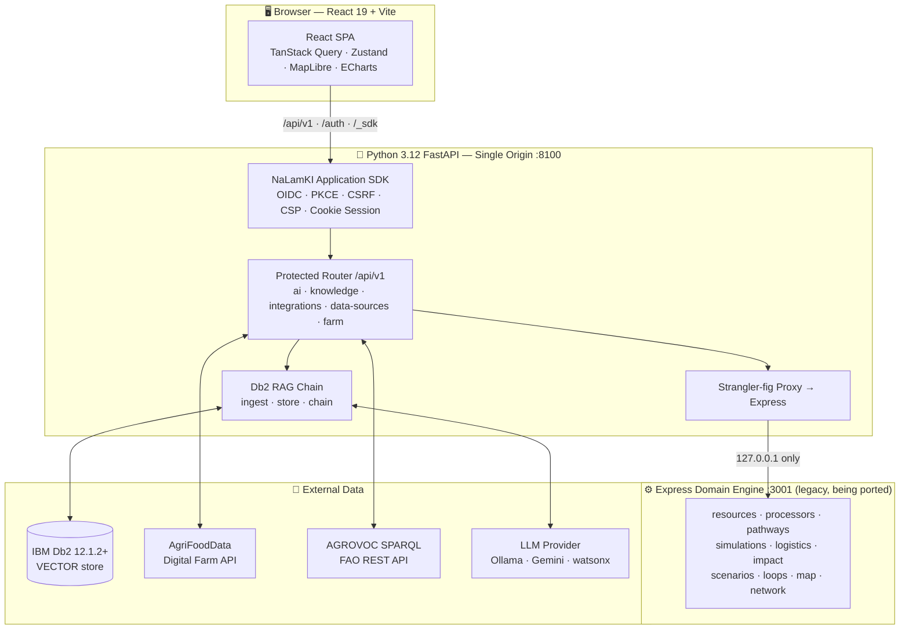
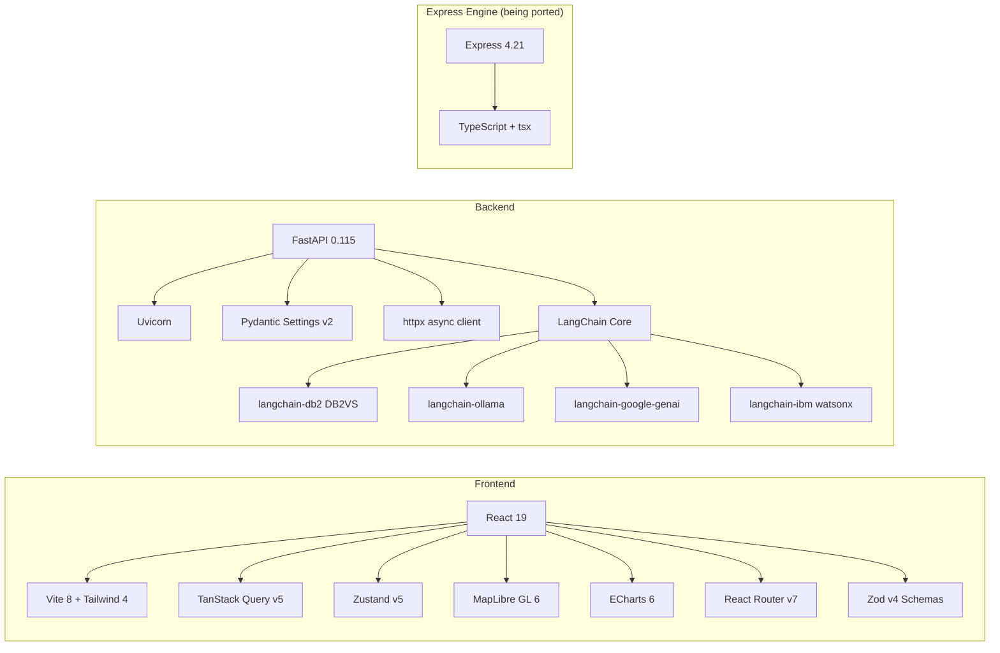
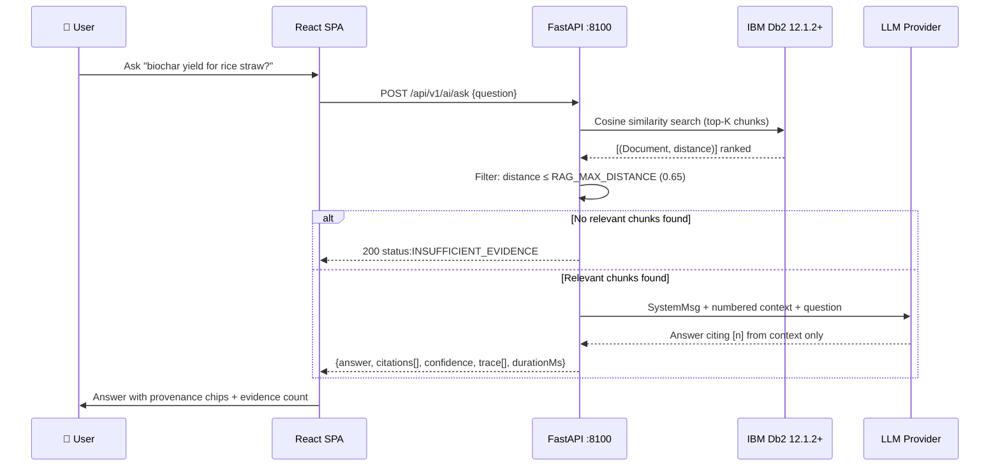
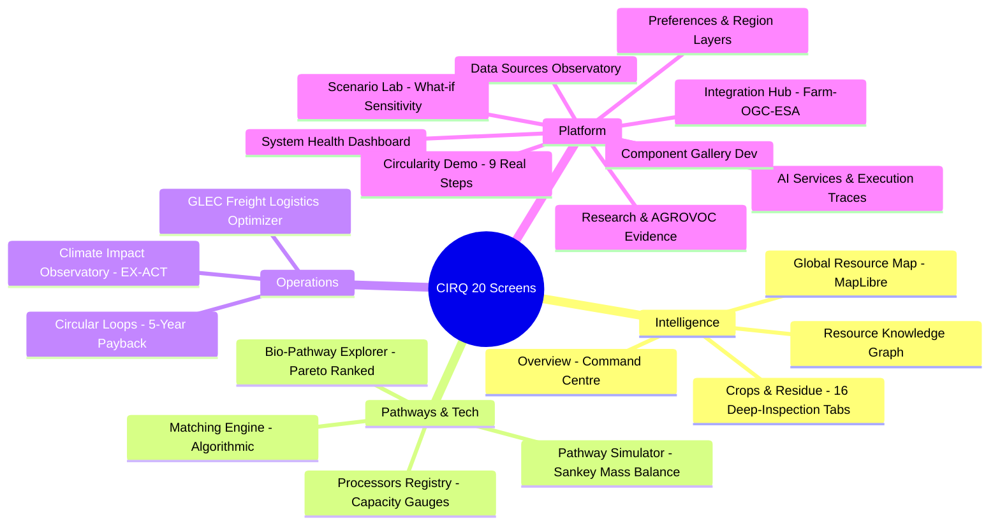
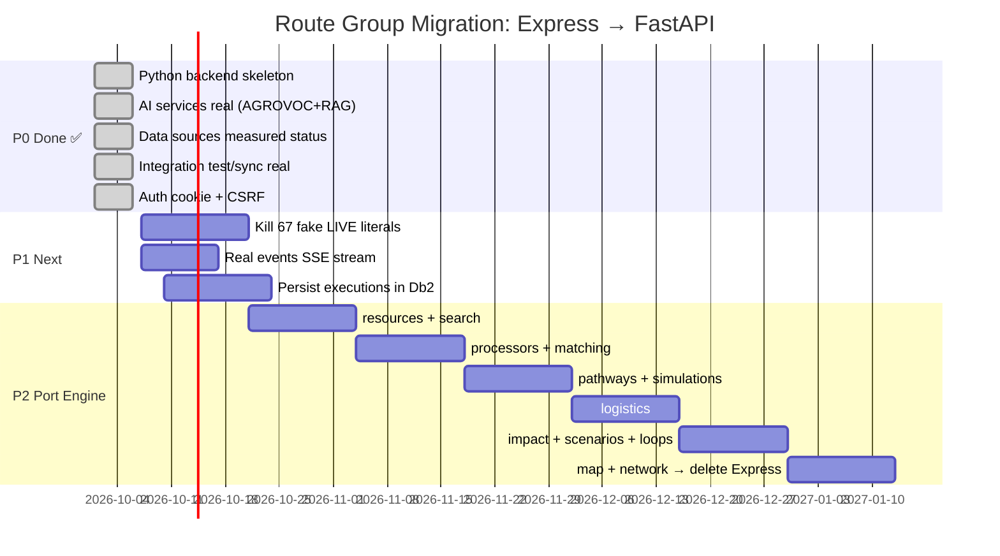
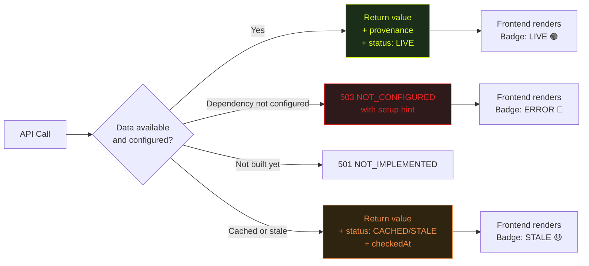
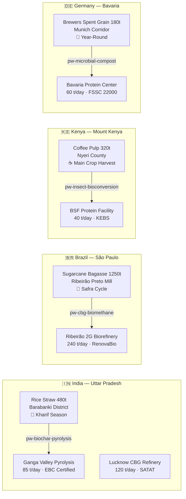

<div align="center">


# CIRQ — Circular Agri-Food Intelligence Platform

<p align="center">
  
  
  
  
  
</p>

<p align="center">
  <strong>AI-powered circular bioeconomy intelligence — feedstock → pathway → processor → logistics → impact</strong><br/>
  <em>Connects agricultural residues to verified, Pareto-optimal circular pathways using real data, real science, and zero mock values.</em>
</p>

---

```
Agricultural Biomass Stream  ──►  Ontology Resolution  ──►  Pathway Discovery
         ──►  Supply-Demand Matching  ──►  GLEC Logistics  ──►  LCA Impact
```

</div>

---

## ✦ What is CIRQ?

Instead of asking *"What can we do with agricultural waste?"*, CIRQ asks:

> **"Given this material, its proximate composition, quantity, location, season, local demand, processor headroom, freight transport cost, environmental boundaries, and available technologies — what is the optimal viable circular pathway?"**

CIRQ is an open, globally extensible intelligence platform that:

- 🌾 **Resolves** raw crop residue names (multilingual, colloquial) to canonical AGROVOC concepts
- 🔬 **Ranks** circular conversion pathways using multi-objective Pareto optimisation (carbon × economy × logistics)
- 🏭 **Matches** feedstock supply to real processor facilities with capacity, certifications and queue data
- 🚛 **Optimises** green freight logistics using the GLEC Framework 3.0 (Diesel vs Electric vs Tractor)
- 📊 **Measures** lifecycle carbon impact via FAO EX-ACT methodology with full provenance
- 🤖 **Answers** research questions from a Db2 vector knowledge base — with citations, never hallucinations

---

## ✦ Architecture



---

## ✦ The Core Product Loop

```mermaid
flowchart LR
    A["🌾 Agricultural\nBiomass Stream"] --> B["🔤 Semantic Ontology\nResolution\nAGROVOC / NaLamKI"]
    B --> C["⚗️ Composition &\nQuality Verification\nMoisture · Ash · CN Ratio"]
    C --> D["🧮 Pareto Pathway\nOptimisation\nCarbon × Economy × Tech"]
    D --> E["🏭 Supply–Demand\nMatching\nFacility Capacity Allocation"]
    E --> F["🚛 GLEC Freight\nLogistics Optimisation\nFramework 3.0"]
    F --> G["⚙️ Processing &\nBio-product Valorisation"]
    G --> H["📊 FAO EX-ACT LCA\nCarbon & Economic Impact"]
    H --> A

    style A fill:#1a2e1a,stroke:#E0FF20,color:#E0FF20
    style D fill:#1a2e1a,stroke:#E0FF20,color:#E0FF20
    style H fill:#1a2e1a,stroke:#E0FF20,color:#E0FF20
```



---

## ✦ Tech Stack



---

## ✦ Data Flow & RAG Pipeline



---

## ✦ Authentication & Security Model

```mermaid
flowchart TD
    subgraph Dev["AUTH_MODE=dev (local)"]
        D1[Fixed DevUser principal\nsub: dev-user, roles: admin]
        D2[DevServiceClient\nplain httpx to Farm API]
    end

    subgraph Prod["AUTH_MODE=appext (production)"]
        P1[NaLamKI Application SDK\nOIDC + PKCE flow]
        P2[__Host- cookie session\nserver-side only]
        P3[X-Appext-CSRF header\non every write method]
        P4[Token Exchange RFC 8693\nfor Farm API calls]
        P5[CSP enforced\nno inline scripts]
    end

    Browser -->|GET /auth/login| P1
    P1 -->|Session cookie set| P2
    P2 -->|Protected routes| P3
    P3 -->|Farm API| P4
    P1 --> P5

    style Dev fill:#1a2210,stroke:#6B8547
    style Prod fill:#0d1a2e,stroke:#E0FF20
```



---

## ✦ Screen Inventory — 20 Feature Screens



---

## ✦ Strangler-Fig Migration Plan (Express → Python)



---

## ✦ Zero-Mock-Data Invariant

This is the single most important rule of CIRQ. Every value must have a source:



**Rules enforced in code:**
- 🚫 Never hardcode a metric, count, latency, confidence, timestamp, DOI, or `status: 'LIVE'`
- 🚫 Confidence must state its method (retrieval similarity, match type, published uncertainty)
- 🚫 Citations must come from retrieved documents with provenance — never generate a DOI
- ✅ If a dependency isn't configured → `503 NOT_CONFIGURED` with a hint
- ✅ Demo/seed data labelled `DEMO` end-to-end, never shown in production as live

---

## ✦ Circular Pathways Supported

| Pathway | Technology | CO₂e Avoided | Score |
|---|---|---|---|
| 🔥 Slow Pyrolysis → Biochar | Continuous Retort 550°C | 1,480 kg/t | **92/100** |
| 💧 Anaerobic Digestion → CBG | Thermophilic CSTR + PSA | 840 kg/t | **88/100** |
| ⚡ Biomass Densification → Pellets | Ring-Die High-Pressure | 680 kg/t | **84/100** |
| 🦟 Black Soldier Fly Bioconversion | Controlled Larval Bioreactor | 1,120 kg/t | **89/100** |
| 🌱 Aerobic Composting | Forced-Aeration Windrow | 420 kg/t | **81/100** |

---

## ✦ Seed Regions & Resources



---

## ✦ Setup & Development

### Prerequisites

```bash
node >= 22      npm >= 10
python >= 3.12  pip >= 24
IBM Db2 >= 12.1.2   (for RAG — optional to start)
```

### Quick Start

```bash
# 1. Clone & install
git clone https://github.com/dhruvinsights/CIRQ-Vishwa.git
cd CIRQ-Vishwa
npm install

# 2. Python environment
python3.12 -m venv .venv && source .venv/bin/activate
pip install -e "backend/[test]"          # add ,appext for NaLamKI SDK

# 3. Configure environment
cp .env.example .env
# Edit .env — fill LLM_PROVIDER, OLLAMA_BASE_URL (or GEMINI_API_KEY), DB2_* if available

# 4. Start everything (Vite :5173 + Python :8100 + Express :3001)
npm run dev

# 5. (Optional) Index your knowledge corpus
npm run ingest

# 6. Run tests & lint
pytest backend/tests
npm run lint
```

### LLM Provider Options

| Provider | Env Variables | Best For |
|---|---|---|
| **Ollama** *(default, recommended)* | `OLLAMA_BASE_URL`, `OLLAMA_CHAT_MODEL=llama3.2`, `OLLAMA_EMBEDDING_MODEL=nomic-embed-text` | On-premise, zero egress, privacy |
| Google Gemini | `GEMINI_API_KEY`, `CHAT_MODEL=gemini-2.5-flash` | Cloud, high throughput |
| IBM watsonx | `WATSONX_URL`, `WATSONX_APIKEY`, `WATSONX_PROJECT_ID` | Enterprise, regulated |

### Docker

```bash
docker build -t cirq .
docker run -p 8100:8100 --env-file .env cirq
```

---

## ✦ API Reference

### Python FastAPI Routes (real, no proxy)

| Method | Route | Description |
|---|---|---|
| `GET` | `/healthz` | Public liveness probe |
| `GET` | `/readyz` | Dependency readiness (Db2, LLM, Farm API) |
| `GET` | `/api/v1/me` | Current user (sub, roles) |
| `GET` | `/api/v1/ai/services` | Real AI service registry |
| `POST` | `/api/v1/ai/services/{id}/execute` | Execute AI service (measured) |
| `POST` | `/api/v1/ai/ask` | Direct RAG Q&A with citations |
| `GET` | `/api/v1/knowledge/search?q=` | Db2 vector search |
| `GET` | `/api/v1/data/sources` | Data sources with measured reachability |
| `GET` | `/api/v1/integrations` | Integration connectors |
| `POST` | `/api/v1/integrations/{id}/test` | Real HTTP reachability test |
| `POST` | `/api/v1/integrations/{id}/sync` | Real Farm API sync |
| `GET` | `/api/v1/farm/{collection}` | Pass-through to AgriFoodData Farm API |
| `GET` | `/api/v1/settings/llm` | Current LLM configuration |
| `POST` | `/api/v1/settings/llm` | Update LLM provider at runtime |

### Express Engine Routes (proxied, being ported)

`/api/v1/resources`, `/api/v1/processors`, `/api/v1/pathways`, `/api/v1/simulations`, `/api/v1/logistics`, `/api/v1/impact`, `/api/v1/scenarios`, `/api/v1/loops`, `/api/v1/map/*`, `/api/v1/network/*`, `/api/v1/system/*`

---

## ✦ Knowledge Corpus & RAG

Add real, citable documents to `backend/corpus/` with a sidecar `.meta.json`:

```json
{
  "title": "Biochar Application in Cereal Agro-Ecosystems",
  "doi": "10.1016/j.jclepro.2025.139481",
  "publisher": "Frontiers in Sustainable Food Systems",
  "license": "CC BY 4.0",
  "url": "https://doi.org/10.1016/j.jclepro.2025.139481",
  "verified": true
}
```

> ⚠️ Only set `"verified": true` after you open the DOI yourself.  
> The confidence score is derived from **cosine retrieval distance** — never from model self-report.

```bash
npm run ingest   # chunks → embeddings → Db2 DB2VS table
```

---

## ✦ Project Structure

```
cirq/
├── backend/                    # Python 3.12 FastAPI
│   ├── app/
│   │   ├── main.py             # FastAPI app + strangler-fig proxy
│   │   ├── auth.py             # SDK / dev auth abstraction
│   │   ├── config.py           # Pydantic settings from env
│   │   ├── errors.py           # ApiError + NotConfigured
│   │   ├── llm.py              # Embeddings + chat model factory
│   │   ├── probe.py            # Real HTTP reachability measurement
│   │   ├── legacy.py           # httpx client → Express engine
│   │   ├── rag/
│   │   │   ├── chain.py        # RAG answer chain (cited, honest)
│   │   │   ├── ingest.py       # Corpus chunking + ingestion
│   │   │   └── store.py        # Db2 DB2VS vector store
│   │   └── routers/
│   │       ├── ai.py           # AI services + executions
│   │       ├── knowledge.py    # Db2 knowledge search
│   │       ├── data_sources.py # Measured data source status
│   │       ├── integrations.py # Real test/sync connectors
│   │       ├── farm.py         # Farm API pass-through
│   │       ├── health.py       # /healthz /readyz /health/*
│   │       ├── me.py           # /me current user
│   │       ├── search_nl.py    # LLM-powered natural language search
│   │       └── settings_router.py  # LLM config at runtime
│   ├── corpus/                 # Add .md/.txt/.pdf + .meta.json here
│   ├── seed/seed.json          # Demo data (labelled DEMO)
│   └── tests/test_api.py       # Honest-value tests
├── server/                     # Legacy Express domain engine
│   ├── api.ts                  # ~1,862 lines, all domain routes
│   ├── db.ts                   # In-memory seed data
│   └── layers.ts               # GeoJSON layer registry
├── src/                        # React 19 frontend
│   ├── api/
│   │   ├── client.ts           # Typed fetch + CSRF + 401 redirect
│   │   ├── clients/            # 18 typed API client modules
│   │   └── schemas/domain.ts   # Zod schemas for all entities
│   ├── components/
│   │   ├── shell/              # AppLayout, Sidebar, TopBar
│   │   └── ui/                 # Badge, StatCard, ConfidenceMeter…
│   ├── features/               # 20 screen components
│   └── stores/                 # Zustand: map, preferences, selection
├── public/data/                # Static GeoJSON (Latur 524 villages)
├── docs/
│   ├── TODO.md                 # Ordered implementation plan
│   ├── AUDIT.md                # What is real vs still fake
│   └── MANUAL_STEPS.md        # Credentials & platform setup
├── Dockerfile                  # Multi-stage: node build → python serve
├── .env.example                # All config keys documented
└── extension.toml              # NaLamKI Application SDK manifest
```

---

## ✦ What We Built — Session Summary

This entire project was designed, architected, and pushed through a live AI-assisted development session. Here is what was accomplished across **5 key deliveries**:

### 1️⃣ Full-Stack Architecture Design
Designed a two-layer architecture: a **Python 3.12 FastAPI backend** (NaLamKI Application SDK, Db2 vector RAG, LangChain) fronting a **React 19 + Vite frontend**, with a legacy Express engine kept alive behind a strangler-fig proxy. One origin, one port, zero token in browser.

### 2️⃣ Zero-Mock-Data Invariant Implementation
Replaced every fabricated API response — fake `COMPLETED` AI executions, hardcoded `records: 4,850,000`, invented `latencyMs: 142` — with real measurements. Status is now derived: `LIVE` only if measured now; otherwise `STALE`, `CACHED`, or `ERROR`. If unconfigured → `503 NOT_CONFIGURED` with a hint.

### 3️⃣ Real AI Services & Db2 RAG Pipeline
Implemented two real AI services:
- **Knowledge Assistant** — Db2 cosine vector search → LLM answer → citations with DOIs, confidence from retrieval distance (not self-report), refuses to answer without evidence
- **AGROVOC Resolver** — Live FAO REST API, multilingual crop name → canonical concept URI, confidence derived from exact/prefix/no match heuristic (documented)

### 4️⃣ Security & Auth Hardening
Removed JWT from `sessionStorage`. Implemented SDK cookie session (`__Host-` prefix), CSRF header on every write method, CSP enforcement, and admin role check on ingest endpoint. `AUTH_MODE=dev` blocked in production.

### 5️⃣ Complete GitHub Push
All 133 source files pushed to [`dhruvinsights/CIRQ-Vishwa`](https://github.com/dhruvinsights/CIRQ-Vishwa) — backend Python, React frontend, Express engine, GeoJSON data, docs, Dockerfile, seed, tests, and this README — via the correct `dhruvinsights` GitHub account after fixing a `gh` active-account credential conflict.

---

## ✦ Known Limitations (Honest)

> See [`docs/AUDIT.md`](docs/AUDIT.md) for the complete audit and [`docs/TODO.md`](docs/TODO.md) for the ordered fix plan.

| What | Status | Fix Plan |
|---|---|---|
| 67 `status: 'LIVE'` literals in `server/api.ts` | ⚠️ Fake | P1 — derive from provenance |
| `/system/events` SSE — `Math.random()` queue depth | ⚠️ Fake | P1 — real event log |
| 5 resources / 5 processors / 5 pathways | 🟡 Demo seed | P2 — Db2 tables + Farm API |
| `/search/regions` hardcoded `activeBiomassTons` | ⚠️ Fake | P1 — derive from Farm API |
| `initialKnowledgeArticles` DOI mismatches | 🔴 Wrong | P1 — delete, use corpus RAG |
| Two processes in one container (Python + Express) | 🏗️ Temporary | P2 — finish port, delete Express |
| In-memory AI executions (lost on restart) | 🟡 Single replica | P1 — persist in Db2 |
| Basemap tiles blocked by SDK CSP | 🟡 Known | P2 — self-host PMTiles |

---

## ✦ Contributing

```bash
# Run all checks before opening a PR
npm run lint          # tsc --noEmit
pytest backend/tests  # honest-value contract tests
npm run build         # ensure Vite build passes
```

Add knowledge to the corpus — real papers, verified DOIs, proper `.meta.json` sidecars.  
Do **not** invent citations, scores, or timestamps.

---

## ✦ License

**Apache 2.0** — open source, free to use, modify and distribute with attribution.

---

<div align="center">

Built with 🌱 for a circular agri-food economy  
[`dhruvinsights/CIRQ-Vishwa`](https://github.com/dhruvinsights/CIRQ-Vishwa) · Apache 2.0

</div>
